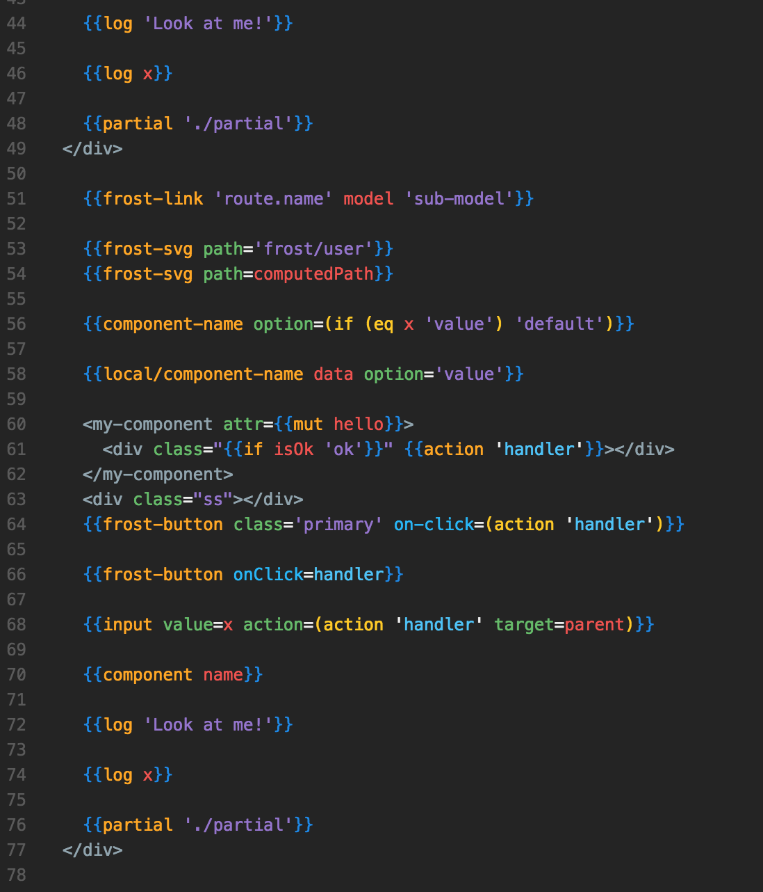
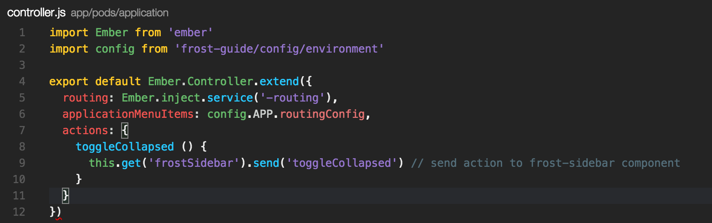

# README:
VsCode extension that colorizes/tokeninzes Ember `.hbs`, Controllers, and Routes files.

Issues: https://github.com/ciena-blueplanet/vscode-ember-colorizer/issues

Change Theme: `Shift+CMD+P` -> Search `Preferences: Color Theme` -> Switch to `Ember Frost`

## Theme:
* Handlebars:
	* 
	* 
* Controller:
	*  	

## Notes:
Be sure to download https://marketplace.visualstudio.com/items?itemName=dzannotti.vscode-babel-coloring for a great VsCode-Ember experience  

### Credits:
Original Handlebars colorizer taken from https://github.com/nrw/sublime-text-handlebars/blob/master/Handlebars.tmLanguage
